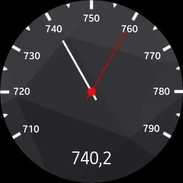

## MyBarometer
#Simple Barometer for Galaxy Watch

write for Tizen OS with C# (XAML)

Show current pressure (white arrow) and old saved pressure (red arrow). To save current value of pressure - tap to red dot on screen center.
